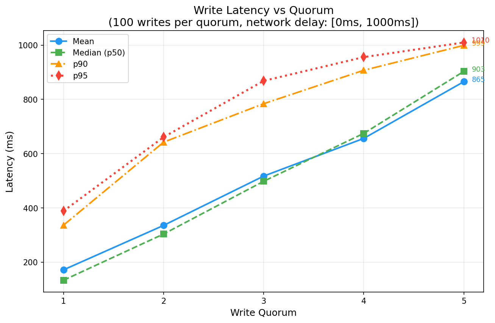

# Laboratory Work #4

## Distributed Key-Value Store with Single-Leader Replication

**Student:** Daniela Cebotari  
**Group:** FAF-231  
**Course:** Network Programming  
**Deadline:** 1st December 2025

---

## Table of Contents

1. [Introduction](#introduction)
2. [Theoretical Background](#theoretical-background)
3. [How to Run](#how-to-run)
4. [System Architecture](#system-architecture)
5. [Implementation Details](#implementation-details)
6. [Docker Configuration](#docker-configuration)
7. [API Specification](#api-specification)
8. [Testing](#testing)
9. [Performance Analysis](#performance-analysis)
10. [Results and Discussion](#results-and-discussion)
11. [Conclusions](#conclusions)
12. [References](#references)

---

## Introduction

This laboratory work implements a distributed key-value store using **single-leader replication** as described in Chapter 5 of "Designing Data-Intensive Applications" by Martin Kleppmann. The system consists of one leader node and five follower nodes, all running in separate Docker containers.

### Objectives

- implement a key-value store with single-leader replication
- use semi-synchronous replication with configurable write quorum
- simulate network latency to observe real-world replication behavior
- analyze system performance under different quorum configurations
- verify data consistency across all replicas

### Requirements Fulfilled

| Requirement | Implementation |
|-------------|----------------|
| single-leader replication | only leader accepts writes, replicates to followers |
| 1 leader + 5 followers | 6 docker containers via docker-compose |
| concurrent request handling | fastapi async endpoints with asyncio |
| semi-synchronous replication | configurable quorum (1-5) via environment variable |
| network delay simulation | random delay [min, max] ms before each replication |
| web api + json | restful api with json request/response |
| integration tests | pytest-based test suite with 14 test cases |
| performance analysis | 100 writes benchmark, quorum vs latency analysis |

---

## Theoretical Background

### Leader-Based Replication

leader-based replication (also known as master-slave replication) works as follows:

1. **leader (master)**: one replica is designated as the leader. all write requests must be sent to the leader, which first writes data to its local storage.

2. **followers (slaves)**: other replicas are followers. whenever the leader writes new data, it sends the change to all followers as part of a replication log. each follower applies writes in the same order as the leader.

3. **read operations**: clients can query either the leader or any follower. writes are only accepted on the leader.

```
┌───────────────────────────────────────────────────────────────┐
│                    LEADER-BASED REPLICATION                   │
├───────────────────────────────────────────────────────────────┤
│                                                               │
│   ┌────────┐         ┌────────┐                               │
│   │ Client │────────▶│ Leader │                               │
│   └────────┘  write  └────────┘                               │
│                          │                                    │
│             ┌────────────┼────────────┐                       │
│             │            │            │                       │
│             ▼            ▼            ▼                       │
│        ┌────────┐  ┌────────┐  ┌────────┐                     │
│        │Follower│  │Follower│  │Follower│                     │
│        │   1    │  │   2    │  │   3    │                     │
│        └────────┘  └────────┘  └────────┘                     │
│             │            │            │                       │
│   ┌────────┐│  ┌────────┐│  ┌────────┐│                       │
│   │ Client │◀──│ Client │◀──│ Client │◀─ (reads)              │
│   └────────┘   └────────┘   └────────┘                        │
│                                                               │
└───────────────────────────────────────────────────────────────┘
```

### Synchronous vs Asynchronous Replication

| Type | Description | Pros | Cons |
|------|-------------|------|------|
| **synchronous** | leader waits for all followers to confirm | guaranteed consistency | single slow follower blocks all writes |
| **asynchronous** | leader doesn't wait for any confirmation | fast writes, high availability | potential data loss if leader fails |
| **semi-synchronous** | leader waits for N followers (quorum) | balance of consistency and availability | configurable trade-off |

### Semi-Synchronous Replication

from the book:

> "if you enable synchronous replication on a database, it usually means that one of the followers is synchronous, and the others are asynchronous. this guarantees that you have an up-to-date copy of the data on at least two nodes: the leader and one synchronous follower. this configuration is sometimes also called semi-synchronous."

in this implementation, the number of synchronous followers is configurable via the `QUORUM` environment variable.

```
┌───────────────────────────────────────────────────────────────┐
│                 SEMI-SYNCHRONOUS REPLICATION                  │
│                        (QUORUM = 2)                           │
├───────────────────────────────────────────────────────────────┤
│                                                               │
│  Client          Leader           Followers (1-5)             │
│    │               │                   │                      │
│    │── POST ──────▶│                   │                      │
│    │               │── delay ─────────▶│ (concurrent to all)  │
│    │               │                   │                      │
│    │               │◀── ack (1) ───────│                      │
│    │               │◀── ack (2) ───────│ ← quorum reached     │
│    │◀── 200 OK ────│                   │                      │
│    │               │◀── ack (3,4,5) ───│ (async, background)  │
│    │               │                   │                      │
└───────────────────────────────────────────────────────────────┘
```

---

## How to Run

### Prerequisites

- docker and docker compose installed
- python 3.11+ (for running tests locally)
- pip packages: httpx, pytest, pytest-asyncio, matplotlib

### Start the Cluster

```bash
# start with default quorum (2)
docker compose up -d --build

# start with custom quorum
QUORUM=3 docker compose up -d --build

# view logs
docker logs kv-leader -f
```

### Run Tests

```bash
# install dependencies
pip install httpx pytest pytest-asyncio matplotlib

# run integration tests
python -m pytest tests/test_integration.py -v
```

### Run Performance Analysis

```bash
# single benchmark run (uses current quorum)
python -m analysis.performance

# full quorum analysis (1-5) - generates plots
python -m analysis.performance --full

# consistency check only
python -m analysis.performance --consistency-only
```

### Manual API Testing

```bash
# health check
curl http://localhost:8080/health

# write to leader
curl -X POST http://localhost:8080/store/mykey \
  -H "Content-Type: application/json" \
  -d '{"value": {"hello": "world"}}'

# read from leader
curl http://localhost:8080/store/mykey

# read from follower
curl http://localhost:8081/store/mykey

# get all data
curl http://localhost:8080/store
```

### Stop the Cluster

```bash
docker compose down
```

---

## System Architecture

### High-Level Architecture

```
┌───────────────────────────────────────────────────────────────┐
│                  DOCKER NETWORK (kv-network)                  │
├───────────────────────────────────────────────────────────────┤
│                                                               │
│  ┌─────────────────────────────────────────────────────────┐  │
│  │                   LEADER (port 8080)                    │  │
│  │  ┌─────────┐  ┌───────────┐  ┌────────────┐             │  │
│  │  │ FastAPI │──│ Replicator│──│ Key-Value  │             │  │
│  │  │  Main   │  │  Module   │  │   Store    │             │  │
│  │  └─────────┘  └───────────┘  └────────────┘             │  │
│  └─────────────────────────────────────────────────────────┘  │
│           │                                                   │
│           │ replication (http post)                           │
│           ▼                                                   │
│  ┌─────────────────────────────────────────────────────────┐  │
│  │                       FOLLOWERS                         │  │
│  │ ┌─────────┐ ┌─────────┐ ┌─────────┐ ┌─────────┐ ┌─────────┐│
│  │ │Follower1│ │Follower2│ │Follower3│ │Follower4│ │Follower5││
│  │ │ :8081   │ │ :8082   │ │ :8083   │ │ :8084   │ │ :8085   ││
│  │ └─────────┘ └─────────┘ └─────────┘ └─────────┘ └─────────┘│
│  └─────────────────────────────────────────────────────────┘  │
│                                                               │
└───────────────────────────────────────────────────────────────┘
```

### Module Structure

```
pr-lab4/
├── app/
│   ├── __init__.py
│   ├── config.py          # environment configuration
│   ├── store.py           # thread-safe key-value store
│   ├── replicator.py      # semi-synchronous replication logic
│   └── main.py            # fastapi application
├── tests/
│   ├── __init__.py
│   └── test_integration.py
├── analysis/
│   ├── __init__.py
│   └── performance.py     # benchmark and plotting script
├── results/
│   ├── latency_percentiles.png  # mean, median, p90, p95 plot
│   ├── all_results.json         # benchmark data
│   └── full_report.txt          # text report
├── .env                   # quorum configuration
├── Dockerfile
├── docker-compose.yaml
├── requirements.txt
└── pytest.ini
```

---

## Implementation Details

### 1. Configuration Module (`app/config.py`)

manages environment variables using pydantic-settings for type-safe configuration.

```python
class Settings(BaseSettings):
    role: Literal["leader", "follower"] = "follower"
    node_name: str = "node"
    quorum: int = 2           # acks required for write success
    delay_min: int = 0        # min replication delay (ms)
    delay_max: int = 1000     # max replication delay (ms)
    followers: str = ""       # comma-separated follower urls
```

| variable | description | default |
|----------|-------------|---------|
| `ROLE` | node role (leader/follower) | follower |
| `NODE_NAME` | node identifier | node |
| `QUORUM` | write quorum size | 2 |
| `DELAY_MIN` | min replication delay (ms) | 0 |
| `DELAY_MAX` | max replication delay (ms) | 1000 |
| `FOLLOWERS` | comma-separated follower urls | "" |

### 2. Key-Value Store (`app/store.py`)

thread-safe in-memory dictionary with asyncio.lock for concurrent access.

```python
class KeyValueStore:
    def __init__(self):
        self._data: dict[str, Any] = {}
        self._lock = asyncio.Lock()

    async def get(self, key: str) -> Any | None
    async def set(self, key: str, value: Any) -> None
    async def delete(self, key: str) -> bool
    async def get_all(self) -> dict[str, Any]
```

### 3. Replicator Module (`app/replicator.py`)

implements semi-synchronous replication with configurable quorum.

**key features:**
- network delay simulation using `asyncio.sleep(uniform(min, max))`
- concurrent replication to all followers using `asyncio.wait`
- quorum-based response: returns as soon as N acks received
- fire-and-forget for remaining replications

**replication algorithm:**

```
function replicate(key, value):
    1. create async tasks for all followers
    2. for each follower:
       a. apply random delay [min, max]
       b. send POST /internal/replicate
    3. wait using asyncio.wait(FIRST_COMPLETED)
    4. count successful acks
    5. if acks >= quorum:
       - return success immediately
       - let remaining tasks complete in background
    6. else:
       - return failure
```

### 4. FastAPI Application (`app/main.py`)

restful api with role-based endpoint behavior.

**leader endpoints:**
- `POST /store/{key}` - write value, trigger replication, wait for quorum
- `GET /store/{key}` - read value from local store
- `GET /store` - return all data
- `DELETE /store/{key}` - delete key

**follower endpoints:**
- `POST /internal/replicate` - receive replication from leader
- `GET /store/{key}` - read value from local store
- `GET /store` - return all data

**common endpoints:**
- `GET /health` - health check

---

## Docker Configuration

### Dockerfile

```dockerfile
FROM python:3.11-slim
WORKDIR /app
COPY requirements.txt .
RUN pip install --no-cache-dir -r requirements.txt
COPY app/ ./app/
EXPOSE 8000
CMD ["python", "-m", "uvicorn", "app.main:app", "--host", "0.0.0.0", "--port", "8000"]
```

### docker-compose.yaml

the compose file defines 6 services:
- 1 leader (port 8080 → 8000)
- 5 followers (ports 8081-8085 → 8000)

**key configuration:**

```yaml
services:
  leader:
    environment:
      - ROLE=leader
      - NODE_NAME=leader
      - QUORUM=${QUORUM:-2}
      - DELAY_MIN=${DELAY_MIN:-0}
      - DELAY_MAX=${DELAY_MAX:-1000}
      - FOLLOWERS=http://follower1:8000,...,http://follower5:8000
    ports:
      - "8080:8000"
    depends_on:
      - follower1
      - follower2
      - follower3
      - follower4
      - follower5

  follower1:
    environment:
      - ROLE=follower
      - NODE_NAME=follower1
    ports:
      - "8081:8000"
  # ... follower2-5 similar
```

---

## API Specification

### Write Key (Leader Only)

```http
POST /store/{key}
Content-Type: application/json

{
  "value": <any json value>
}
```

**response (200 ok):**
```json
{
  "success": true,
  "key": "my_key",
  "quorum_acks": 2,
  "message": "write successful with 2 acknowledgments"
}
```

**response (403 forbidden - on follower):**
```json
{
  "detail": "writes are only accepted on the leader node"
}
```

### Read Key

```http
GET /store/{key}
```

**response (200 ok):**
```json
{
  "key": "my_key",
  "value": {"data": "example"},
  "found": true
}
```

### Get All Data

```http
GET /store
```

**response (200 ok):**
```json
{
  "node": "leader",
  "data": {
    "key1": "value1",
    "key2": "value2"
  },
  "size": 2
}
```

### Health Check

```http
GET /health
```

**response (200 ok):**
```json
{
  "status": "healthy",
  "node": "leader",
  "role": "leader"
}
```

### Internal Replication (Followers Only)

```http
POST /internal/replicate
Content-Type: application/json

{
  "key": "my_key",
  "value": <any json value>
}
```

**response (200 ok):**
```json
{
  "status": "ok",
  "key": "my_key"
}
```

---

## Testing

### Integration Test Suite

the test suite includes 14 test cases organized into 6 test classes:

| class | tests | description |
|-------|-------|-------------|
| `TestHealthCheck` | 2 | verify leader and all followers are healthy |
| `TestBasicOperations` | 3 | write, read, and read nonexistent key |
| `TestReplication` | 3 | replication to followers, quorum behavior, read from follower |
| `TestFollowerBehavior` | 2 | followers reject writes, accept reads |
| `TestConsistency` | 2 | all data endpoint, eventual consistency |
| `TestConcurrentWrites` | 2 | concurrent writes to different and same keys |

### Test Results

```
============================= test session starts =============================
platform win32 -- Python 3.14.0, pytest-9.0.1, pluggy-1.6.0
collected 14 items

tests/test_integration.py::TestHealthCheck::test_leader_health PASSED    [  7%]
tests/test_integration.py::TestHealthCheck::test_all_followers_health PASSED [ 14%]
tests/test_integration.py::TestBasicOperations::test_write_to_leader PASSED [ 21%]
tests/test_integration.py::TestBasicOperations::test_read_from_leader PASSED [ 28%]
tests/test_integration.py::TestBasicOperations::test_read_nonexistent_key PASSED [ 35%]
tests/test_integration.py::TestReplication::test_replication_to_all_followers PASSED [ 42%]
tests/test_integration.py::TestReplication::test_write_quorum PASSED     [ 50%]
tests/test_integration.py::TestReplication::test_read_from_follower PASSED [ 57%]
tests/test_integration.py::TestFollowerBehavior::test_follower_rejects_writes PASSED [ 64%]
tests/test_integration.py::TestFollowerBehavior::test_follower_accepts_reads PASSED [ 71%]
tests/test_integration.py::TestConsistency::test_all_data_endpoint PASSED [ 78%]
tests/test_integration.py::TestConsistency::test_eventual_consistency PASSED [ 85%]
tests/test_integration.py::TestConcurrentWrites::test_concurrent_writes PASSED [ 92%]
tests/test_integration.py::TestConcurrentWrites::test_concurrent_writes_same_key PASSED [100%]

============================= 14 passed in 31.86s =============================
```

**all 14 tests passed ✓**

---

## Performance Analysis

### Benchmark Configuration

| parameter | value |
|-----------|-------|
| total writes per quorum | 100 |
| number of keys per quorum | 10 |
| writes per key | 10 |
| concurrent batch size | 10 |
| network delay range | [0ms, 1000ms] |
| quorum values tested | 1, 2, 3, 4, 5 |
| total keys across all tests | 50 (10 per quorum x 5 quorums) |

### Full Quorum Analysis Results

the benchmark was run for each quorum value (1-5), restarting docker between runs to apply the new quorum configuration:

| quorum | mean (ms) | median (ms) | p90 (ms) | p95 (ms) | min (ms) | max (ms) | success |
|--------|-----------|-------------|----------|----------|----------|----------|---------|
| 1 | 239 | 220 | 435 | 506 | 58 | 656 | 100/100 |
| 2 | 406 | 405 | 668 | 751 | 95 | 848 | 100/100 |
| 3 | 555 | 546 | 832 | 877 | 161 | 962 | 100/100 |
| 4 | 740 | 763 | 961 | 1011 | 300 | 1089 | 100/100 |
| 5 | 897 | 946 | 1056 | 1070 | 446 | 1086 | 100/100 |

### Latency Percentiles Plot



this plot shows four latency metrics for each quorum value:
- **Mean** (blue solid line): average of all 100 latency measurements
- **Median / p50** (green dashed line): 50% of requests completed faster than this
- **p90** (orange dash-dot line): 90% of requests completed faster than this
- **p95** (red dotted line): 95% of requests completed faster than this (tail latency)

**key observations:**
1. all metrics increase as quorum increases (expected behavior)
2. mean and median are close, indicating symmetric distribution
3. p90 and p95 show tail latency - occasional slow responses
4. at quorum=5, mean (~897ms) approaches the max delay (1000ms)

### Understanding Percentiles

| percentile | meaning | why it matters |
|------------|---------|----------------|
| **mean** | arithmetic average | overall performance indicator |
| **median (p50)** | middle value when sorted | robust to outliers |
| **p90** | 90% of requests are faster | typical worst-case for most users |
| **p95** | 95% of requests are faster | tail latency, SLA threshold |

**practical interpretation:**
- for quorum=2, 90% of writes complete in under 668ms
- only 5% of writes take longer than 751ms
- this matters for user experience and SLA guarantees

### Why Latency Increases with Quorum

with quorum-based replication, the leader waits for K followers to acknowledge:

```
quorum=1: wait for FASTEST follower   → mean ~239ms
quorum=2: wait for 2nd fastest        → mean ~406ms  
quorum=3: wait for 3rd (median)       → mean ~555ms
quorum=4: wait for 4th fastest        → mean ~740ms
quorum=5: wait for SLOWEST follower   → mean ~897ms
```

**the trade-off:**
- **higher quorum** = more durable (data confirmed on more nodes)
- **higher quorum** = higher latency (must wait for slower nodes)

this is the fundamental **consistency vs latency** trade-off in distributed systems.

### Consistency Check Results

**important note:** since the key-value store is in-memory and docker containers are restarted between quorum tests, each test starts with an empty store. the final consistency check only verifies the last quorum=5 run.

after the quorum=5 benchmark (10 unique keys, 100 writes):

```
--- checking data consistency ---
  leader has 10 keys
  follower1: 10 keys
  follower2: 10 keys
  follower3: 10 keys
  follower4: 10 keys
  follower5: 10 keys
```

**observed behavior:**
- all nodes have the same 10 keys
- key count matches across all replicas
- semi-synchronous replication ensures quorum copies before acknowledging writes
- async background replication propagates to remaining followers

**why eventual consistency works:**
1. writes to same key may arrive in different order on different followers
2. the last write wins (no conflict resolution)
3. after replication completes, all nodes converge to the same final state
4. the 5-second wait after benchmark ensures async replication finishes

---

## Results and Discussion

### Key Findings

1. **quorum directly impacts all latency percentiles**
   - quorum=1: mean 239ms, median 220ms, p95 506ms
   - quorum=5: mean 897ms, median 946ms, p95 1070ms
   - ~3.7x increase in mean latency from quorum 1 to 5

2. **percentile distribution insights**
   - mean and median are close, indicating symmetric latency distribution
   - p90 and p95 reveal tail latency (occasional slow responses)
   - at high quorum, p95 approaches max delay (1000ms)

3. **semi-synchronous replication works correctly**
   - leader waits for exactly `quorum` acknowledgments before responding
   - remaining followers receive updates asynchronously in background
   - 100% success rate across all 500 writes

4. **network delay simulation effective**
   - observed latency range matches configured delay (0-1000ms)
   - random delays create realistic replication behavior

5. **data consistency achieved**
   - all followers receive all keys (same count as leader)
   - semi-synchronous guarantees data on quorum nodes before ack

### Trade-offs Observed

| aspect | low quorum (1-2) | high quorum (4-5) |
|--------|------------------|-------------------|
| mean latency | ~240-406ms | ~740-897ms |
| p95 latency | ~506-751ms | ~1011-1070ms |
| durability | data on 2-3 nodes | data on 5-6 nodes |
| availability | high (fewer nodes needed) | lower (all nodes needed) |

### Latency by Quorum Summary

| quorum | mean | median | p90 | p95 |
|--------|------|--------|-----|-----|
| 1 | 239ms | 220ms | 435ms | 506ms |
| 2 | 406ms | 405ms | 668ms | 751ms |
| 3 | 555ms | 546ms | 832ms | 877ms |
| 4 | 740ms | 763ms | 961ms | 1011ms |
| 5 | 897ms | 946ms | 1056ms | 1070ms |

---

## Conclusions

This laboratory work successfully implements a distributed key-value store with single-leader replication following the principles from "Designing Data-Intensive Applications" by Martin Kleppmann. The system features leader-based replication with 1 leader and 5 followers, semi-synchronous replication with configurable write quorum (1-5), and network latency simulation in the range [0ms, 1000ms] for realistic testing. The implementation uses FastAPI with asyncio for concurrent request handling, Docker containerization with docker-compose orchestration, and includes a comprehensive test suite with 14 passing tests.

The performance analysis with 500 total writes (100 per quorum value) revealed clear insights about distributed system trade-offs. Quorum selection directly impacts latency: higher quorum means better durability but higher latency, with a 3.7x increase from quorum=1 to quorum=5. The percentile metrics (mean, median, p90, p95) proved valuable for understanding tail latency that simple averages would hide. The use of `asyncio.wait` with `FIRST_COMPLETED` proved ideal for implementing quorum-based acknowledgment patterns, and Docker networking significantly simplified distributed system development and testing.

Future improvements could include implementing leader election for fault tolerance, adding persistent storage (currently in-memory only), implementing read-your-writes consistency guarantees, adding conflict resolution for concurrent writes, and implementing log-based replication for crash recovery.

---

## References

1. Kleppmann, Martin. "Designing Data-Intensive Applications." O'Reilly Media, 2017. Chapter 5: Replication.

2. FastAPI Documentation. https://fastapi.tiangolo.com/

3. Python asyncio Documentation. https://docs.python.org/3/library/asyncio.html

4. Docker Compose Documentation. https://docs.docker.com/compose/

5. Pydantic Settings. https://docs.pydantic.dev/latest/concepts/pydantic_settings/
