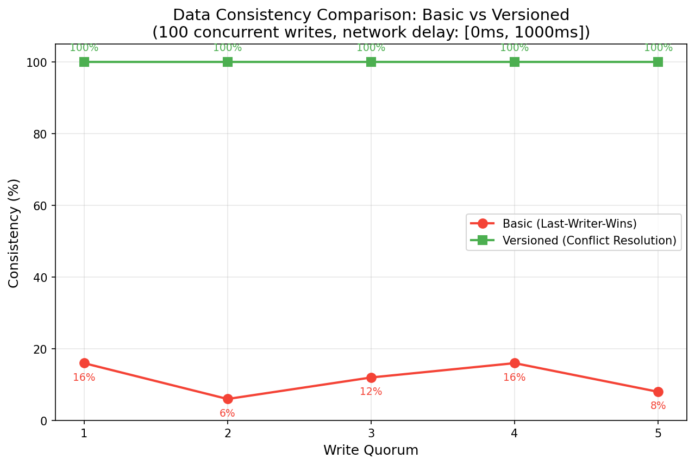
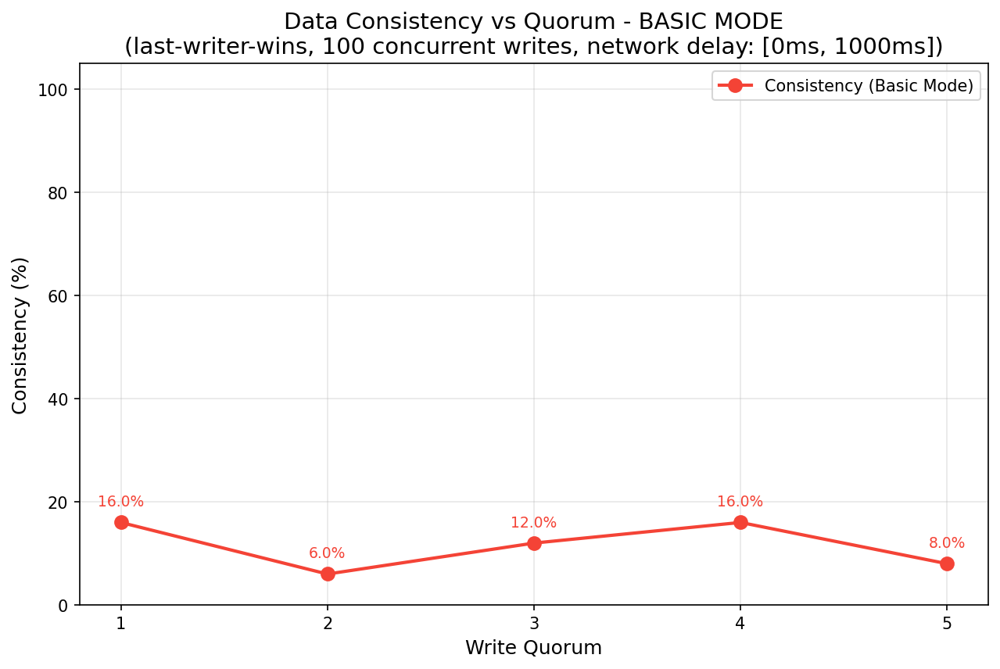
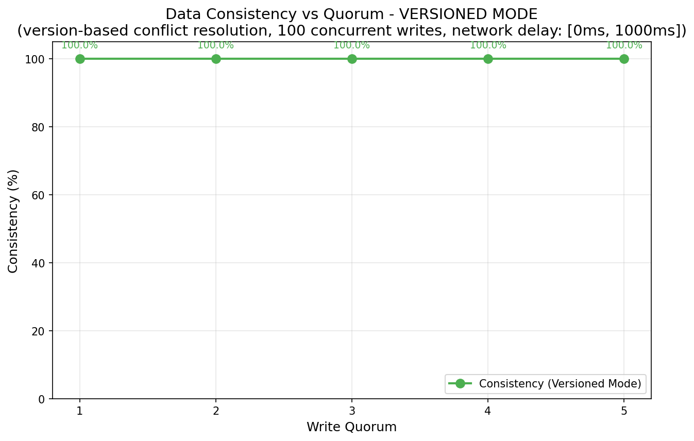

# Laboratory Work #4

## Distributed Key-Value Store with Single-Leader Replication

**Student:** Daniela Cebotari  
**Group:** FAF-231  
**Course:** Network Programming  
**Deadline:** 1st December 2025

---

## Table of Contents

1. [Introduction](#introduction)
2. [Theoretical Background](#theoretical-background)
3. [How to Run](#how-to-run)
4. [System Architecture](#system-architecture)
5. [Implementation Details](#implementation-details)
6. [Docker Configuration](#docker-configuration)
7. [API Specification](#api-specification)
8. [Testing](#testing)
9. [Performance Analysis](#performance-analysis)
10. [Results and Discussion](#results-and-discussion)
11. [Conclusions](#conclusions)
12. [References](#references)

---

## Introduction

This laboratory work implements a distributed key-value store using **single-leader replication** as described in Chapter 5 of "Designing Data-Intensive Applications" by Martin Kleppmann. The system consists of one leader node and five follower nodes, all running in separate Docker containers.

### Objectives

- implement a key-value store with single-leader replication
- use semi-synchronous replication with configurable write quorum
- simulate network latency to observe real-world replication behavior
- analyze system performance under different quorum configurations
- verify data consistency across all replicas

### Requirements Fulfilled

| Requirement | Implementation |
|-------------|----------------|
| single-leader replication | only leader accepts writes, replicates to followers |
| 1 leader + 5 followers | 6 docker containers via docker-compose |
| concurrent request handling | fastapi async endpoints with asyncio |
| semi-synchronous replication | configurable quorum (1-5) via environment variable |
| network delay simulation | random delay [min, max] ms before each replication |
| web api + json | restful api with json request/response |
| integration tests | pytest-based test suite with 20 test cases |
| performance analysis | 100 writes benchmark, quorum vs latency analysis |

---

## Theoretical Background

### Leader-Based Replication

leader-based replication (also known as master-slave replication) works as follows:

1. **leader (master)**: one replica is designated as the leader. all write requests must be sent to the leader, which first writes data to its local storage.

2. **followers (slaves)**: other replicas are followers. whenever the leader writes new data, it sends the change to all followers as part of a replication log. each follower applies writes in the same order as the leader.

3. **read operations**: clients can query either the leader or any follower. writes are only accepted on the leader.

```
┌───────────────────────────────────────────────────────────────┐
│                    LEADER-BASED REPLICATION                   │
├───────────────────────────────────────────────────────────────┤
│                                                               │
│   ┌────────┐         ┌────────┐                               │
│   │ Client │────────▶│ Leader │                               │
│   └────────┘  write  └────────┘                               │
│                          │                                    │
│             ┌────────────┼────────────┐                       │
│             │            │            │                       │
│             ▼            ▼            ▼                       │
│        ┌────────┐  ┌────────┐  ┌────────┐                     │
│        │Follower│  │Follower│  │Follower│                     │
│        │   1    │  │   2    │  │   3    │                     │
│        └────────┘  └────────┘  └────────┘                     │
│             │            │            │                       │
│   ┌────────┐│  ┌────────┐│  ┌────────┐│                       │
│   │ Client │◀──│ Client │◀──│ Client │◀─ (reads)              │
│   └────────┘   └────────┘   └────────┘                        │
│                                                               │
└───────────────────────────────────────────────────────────────┘
```

### Synchronous vs Asynchronous Replication

| Type | Description | Pros | Cons |
|------|-------------|------|------|
| **synchronous** | leader waits for all followers to confirm | guaranteed consistency | single slow follower blocks all writes |
| **asynchronous** | leader doesn't wait for any confirmation | fast writes, high availability | potential data loss if leader fails |
| **semi-synchronous** | leader waits for N followers (quorum) | balance of consistency and availability | configurable trade-off |

### Semi-Synchronous Replication

from the book:

> "if you enable synchronous replication on a database, it usually means that one of the followers is synchronous, and the others are asynchronous. this guarantees that you have an up-to-date copy of the data on at least two nodes: the leader and one synchronous follower. this configuration is sometimes also called semi-synchronous."

in this implementation, the number of synchronous followers is configurable via the `QUORUM` environment variable.

```
┌───────────────────────────────────────────────────────────────┐
│                 SEMI-SYNCHRONOUS REPLICATION                  │
│                        (QUORUM = 2)                           │
├───────────────────────────────────────────────────────────────┤
│                                                               │
│  Client          Leader           Followers (1-5)             │
│    │               │                   │                      │
│    │── POST ──────▶│                   │                      │
│    │               │── delay ─────────▶│ (concurrent to all)  │
│    │               │                   │                      │
│    │               │◀── ack (1) ───────│                      │
│    │               │◀── ack (2) ───────│ ← quorum reached     │
│    │◀── 200 OK ────│                   │                      │
│    │               │◀── ack (3,4,5) ───│ (async, background)  │
│    │               │                   │                      │
└───────────────────────────────────────────────────────────────┘
```

---

## How to Run

### Prerequisites

- docker and docker compose installed
- python 3.11+ (for running tests locally)
- pip packages: httpx, pytest, pytest-asyncio, matplotlib

### Start the Cluster

```bash
# start with default quorum (2)
docker compose up -d --build

# start with custom quorum
QUORUM=3 docker compose up -d --build

# view logs
docker logs kv-leader -f
```

### Run Tests

```bash
# install dependencies
pip install httpx pytest pytest-asyncio matplotlib

# run integration tests
python -m pytest tests/test_integration.py -v
```

### Run Performance Analysis

```bash
# single benchmark run (uses current quorum)
python -m analysis.performance

# full quorum analysis with BOTH modes (generates comparison plot)
python -m analysis.performance --full

# basic mode only (last-writer-wins, shows race conditions)
python -m analysis.performance --full-basic

# versioned mode only (conflict resolution, no race conditions)
python -m analysis.performance --full-versioned

# consistency check only
python -m analysis.performance --consistency-only
```

### Manual API Testing

```bash
# health check
curl http://localhost:8080/health

# write to leader
curl -X POST http://localhost:8080/store/mykey \
  -H "Content-Type: application/json" \
  -d '{"value": {"hello": "world"}}'

# read from leader
curl http://localhost:8080/store/mykey

# read from follower
curl http://localhost:8081/store/mykey

# get all data
curl http://localhost:8080/store
```

### Stop the Cluster

```bash
docker compose down
```

---

## System Architecture

### High-Level Architecture

```
┌───────────────────────────────────────────────────────────────┐
│                  DOCKER NETWORK (kv-network)                  │
├───────────────────────────────────────────────────────────────┤
│                                                               │
│  ┌─────────────────────────────────────────────────────────┐  │
│  │                   LEADER (port 8080)                    │  │
│  │  ┌─────────┐  ┌───────────┐  ┌────────────┐             │  │
│  │  │ FastAPI │──│ Replicator│──│ Key-Value  │             │  │
│  │  │  Main   │  │  Module   │  │   Store    │             │  │
│  │  └─────────┘  └───────────┘  └────────────┘             │  │
│  └─────────────────────────────────────────────────────────┘  │
│           │                                                   │
│           │ replication (http post)                           │
│           ▼                                                   │
│  ┌─────────────────────────────────────────────────────────┐  │
│  │                       FOLLOWERS                         │  │
│  │ ┌─────────┐ ┌─────────┐ ┌─────────┐ ┌─────────┐ ┌─────────┐│
│  │ │Follower1│ │Follower2│ │Follower3│ │Follower4│ │Follower5││
│  │ │ :8081   │ │ :8082   │ │ :8083   │ │ :8084   │ │ :8085   ││
│  │ └─────────┘ └─────────┘ └─────────┘ └─────────┘ └─────────┘│
│  └─────────────────────────────────────────────────────────┘  │
│                                                               │
└───────────────────────────────────────────────────────────────┘
```

### Module Structure

```
pr-lab4/
├── app/
│   ├── __init__.py
│   ├── config.py          # environment configuration
│   ├── store.py           # thread-safe key-value store
│   ├── replicator.py      # semi-synchronous replication logic
│   └── main.py            # fastapi application
├── tests/
│   ├── __init__.py
│   └── test_integration.py
├── analysis/
│   ├── __init__.py
│   └── performance.py     # benchmark and plotting script
├── results/
│   ├── latency_percentiles.png  # mean, median, p90, p95 plot
│   ├── all_results.json         # benchmark data
│   └── full_report.txt          # text report
├── .env                   # quorum configuration
├── Dockerfile
├── docker-compose.yaml
├── requirements.txt
└── pytest.ini
```

---

## Implementation Details

### 1. Configuration Module (`app/config.py`)

manages environment variables using pydantic-settings for type-safe configuration.

```python
class Settings(BaseSettings):
    role: Literal["leader", "follower"] = "follower"
    node_name: str = "node"
    quorum: int = 2           # acks required for write success
    delay_min: int = 0        # min replication delay (ms)
    delay_max: int = 1000     # max replication delay (ms)
    followers: str = ""       # comma-separated follower urls
```

| variable | description | default |
|----------|-------------|---------|
| `ROLE` | node role (leader/follower) | follower |
| `NODE_NAME` | node identifier | node |
| `QUORUM` | write quorum size | 2 |
| `DELAY_MIN` | min replication delay (ms) | 0 |
| `DELAY_MAX` | max replication delay (ms) | 1000 |
| `FOLLOWERS` | comma-separated follower urls | "" |

### 2. Key-Value Store (`app/store.py`)

thread-safe in-memory dictionary with asyncio.lock for concurrent access. supports both basic (last-writer-wins) and versioned (conflict resolution) modes.

```python
class KeyValueStore:
    def __init__(self):
        self._data: dict[str, Any] = {}
        self._versions: dict[str, int] = {}  # per-key version tracking
        self._lock = asyncio.Lock()

    async def get(self, key: str) -> Any | None
    async def set(self, key: str, value: Any) -> None  # basic mode
    async def set_versioned(self, key: str, value: Any, version: int) -> bool  # versioned mode
    async def delete(self, key: str) -> bool
    async def get_all(self) -> dict[str, Any]
```

**versioned mode:** `set_versioned()` only accepts writes where `version > current_version`. this handles out-of-order message delivery by rejecting stale writes, eliminating race conditions from concurrent writes with network delays.

### 3. Replicator Module (`app/replicator.py`)

implements semi-synchronous replication with configurable quorum.

**key features:**
- network delay simulation using `asyncio.sleep(uniform(min, max))`
- concurrent replication to all followers using `asyncio.wait`
- quorum-based response: returns as soon as N acks received
- fire-and-forget for remaining replications

**replication algorithm:**

```
function replicate(key, value):
    1. create async tasks for all followers
    2. for each follower:
       a. apply random delay [min, max]
       b. send POST /internal/replicate
    3. wait using asyncio.wait(FIRST_COMPLETED)
    4. count successful acks
    5. if acks >= quorum:
       - return success immediately
       - let remaining tasks complete in background
    6. else:
       - return failure
```

### 4. FastAPI Application (`app/main.py`)

restful api with role-based endpoint behavior.

**leader endpoints:**
- `POST /store/{key}` - write value, trigger replication, wait for quorum
- `GET /store/{key}` - read value from local store
- `GET /store` - return all data
- `DELETE /store/{key}` - delete key

**follower endpoints:**
- `POST /internal/replicate` - receive replication from leader
- `GET /store/{key}` - read value from local store
- `GET /store` - return all data

**common endpoints:**
- `GET /health` - health check

---

## Docker Configuration

### Dockerfile

```dockerfile
FROM python:3.11-slim
WORKDIR /app
COPY requirements.txt .
RUN pip install --no-cache-dir -r requirements.txt
COPY app/ ./app/
EXPOSE 8000
CMD ["python", "-m", "uvicorn", "app.main:app", "--host", "0.0.0.0", "--port", "8000"]
```

### docker-compose.yaml

the compose file defines 6 services:
- 1 leader (port 8080 → 8000)
- 5 followers (ports 8081-8085 → 8000)

**key configuration:**

```yaml
services:
  leader:
    environment:
      - ROLE=leader
      - NODE_NAME=leader
      - QUORUM=${QUORUM:-2}
      - DELAY_MIN=${DELAY_MIN:-0}
      - DELAY_MAX=${DELAY_MAX:-1000}
      - FOLLOWERS=http://follower1:8000,...,http://follower5:8000
    ports:
      - "8080:8000"
    depends_on:
      - follower1
      - follower2
      - follower3
      - follower4
      - follower5

  follower1:
    environment:
      - ROLE=follower
      - NODE_NAME=follower1
    ports:
      - "8081:8000"
  # ... follower2-5 similar
```

---

## API Specification

### Write Key (Leader Only)

```http
POST /store/{key}
Content-Type: application/json

{
  "value": <any json value>
}
```

**query parameters:**
- `versioned=true` - use version-based conflict resolution (optional)

**response (200 ok):**
```json
{
  "success": true,
  "key": "my_key",
  "quorum_acks": 2,
  "message": "write successful with 2 acknowledgments",
  "version": 1  // only present when versioned=true
}
```

**response (403 forbidden - on follower):**
```json
{
  "detail": "writes are only accepted on the leader node"
}
```

### Read Key

```http
GET /store/{key}
```

**response (200 ok):**
```json
{
  "key": "my_key",
  "value": {"data": "example"},
  "found": true
}
```

### Get All Data

```http
GET /store
```

**response (200 ok):**
```json
{
  "node": "leader",
  "data": {
    "key1": "value1",
    "key2": "value2"
  },
  "size": 2
}
```

### Health Check

```http
GET /health
```

**response (200 ok):**
```json
{
  "status": "healthy",
  "node": "leader",
  "role": "leader"
}
```

### Internal Replication (Followers Only)

```http
POST /internal/replicate
Content-Type: application/json

{
  "key": "my_key",
  "value": <any json value>
}
```

**response (200 ok):**
```json
{
  "status": "ok",
  "key": "my_key"
}
```

---

## Testing

### Integration Test Suite

the test suite includes 20 test cases organized into 7 test classes:

| class | tests | description |
|-------|-------|-------------|
| `TestHealthCheck` | 2 | verify leader and all followers are healthy |
| `TestBasicOperations` | 3 | write, read, and read nonexistent key |
| `TestReplication` | 3 | replication to followers, quorum behavior, read from follower |
| `TestFollowerBehavior` | 2 | followers reject writes, accept reads |
| `TestConsistency` | 2 | all data endpoint, eventual consistency |
| `TestConcurrentWrites` | 2 | concurrent writes to different and same keys |
| `TestVersionedWrites` | 6 | versioned writes, version increments, conflict resolution |

### Test Results

```
============================= test session starts =============================
platform win32 -- Python 3.14.0, pytest-9.0.1, pluggy-1.6.0
collected 20 items

tests/test_integration.py::TestHealthCheck::test_leader_health PASSED    [  5%]
tests/test_integration.py::TestHealthCheck::test_all_followers_health PASSED [ 10%]
tests/test_integration.py::TestBasicOperations::test_write_to_leader PASSED [ 15%]
tests/test_integration.py::TestBasicOperations::test_read_from_leader PASSED [ 20%]
tests/test_integration.py::TestBasicOperations::test_read_nonexistent_key PASSED [ 25%]
tests/test_integration.py::TestReplication::test_replication_to_all_followers PASSED [ 30%]
tests/test_integration.py::TestReplication::test_write_quorum PASSED     [ 35%]
tests/test_integration.py::TestReplication::test_read_from_follower PASSED [ 40%]
tests/test_integration.py::TestFollowerBehavior::test_follower_rejects_writes PASSED [ 45%]
tests/test_integration.py::TestFollowerBehavior::test_follower_accepts_reads PASSED [ 50%]
tests/test_integration.py::TestConsistency::test_all_data_endpoint PASSED [ 55%]
tests/test_integration.py::TestConsistency::test_eventual_consistency PASSED [ 60%]
tests/test_integration.py::TestConcurrentWrites::test_concurrent_writes PASSED [ 65%]
tests/test_integration.py::TestConcurrentWrites::test_concurrent_writes_same_key PASSED [ 70%]
tests/test_integration.py::TestVersionedWrites::test_versioned_write_returns_version PASSED [ 75%]
tests/test_integration.py::TestVersionedWrites::test_versioned_write_increments_version PASSED [ 80%]
tests/test_integration.py::TestVersionedWrites::test_versioned_write_final_value_is_latest PASSED [ 85%]
tests/test_integration.py::TestVersionedWrites::test_versioned_concurrent_writes_consistency PASSED [ 90%]
tests/test_integration.py::TestVersionedWrites::test_versioned_replication_ordering PASSED [ 95%]
tests/test_integration.py::TestVersionedWrites::test_basic_write_has_no_version PASSED [100%]

======================== 20 passed in 65.25s (0:01:05) ========================
```

**all 20 tests passed**

---

## Performance Analysis

### Benchmark Configuration

| parameter | value |
|-----------|-------|
| total writes per quorum | 100 |
| number of keys per quorum | 10 |
| writes per key | 10 |
| write mode | ALL 100 writes fired concurrently (creates race conditions) |
| network delay range | [0ms, 1000ms] |
| quorum values tested | 1, 2, 3, 4, 5 |
| modes tested | basic (last-writer-wins), versioned (conflict resolution) |

**key difference:** all 100 writes (10 keys x 10 writes each) are fired concurrently to the same keys. this creates realistic race conditions from concurrent writes with random network delays.

### Two Consistency Modes

the system supports two write modes to demonstrate the race condition problem and its solution:

| mode | description | consistency |
|------|-------------|-------------|
| **basic** | last-writer-wins semantics | low (6-16%) - race conditions |
| **versioned** | version-based conflict resolution | 100% - no race conditions |

### Race Condition Explanation

```
the problem (basic mode):
  write 1: key=A, value="v1" → replication delay = 900ms
  write 2: key=A, value="v2" → replication delay = 100ms
  
  at follower:
    - write 2 arrives first (delay 100ms)
    - write 1 arrives later (delay 900ms) and OVERWRITES write 2
    - follower has "v1" but leader has "v2" (INCONSISTENT)

the solution (versioned mode):
  write 1: key=A, value="v1", version=1 → replication delay = 900ms
  write 2: key=A, value="v2", version=2 → replication delay = 100ms
  
  at follower:
    - write 2 arrives first: version=2 > 0, ACCEPT (stores "v2", version=2)
    - write 1 arrives later: version=1 <= 2, REJECT (stale write)
    - follower has "v2" matching leader (CONSISTENT)
```

### Consistency Comparison Results

#### Basic Mode (Race Conditions)

| quorum | consistency (%) | matching pairs | total pairs |
|--------|-----------------|----------------|-------------|
| 1 | 16.0 | 8 | 50 |
| 2 | 6.0 | 3 | 50 |
| 3 | 12.0 | 6 | 50 |
| 4 | 16.0 | 8 | 50 |
| 5 | 8.0 | 4 | 50 |

#### Versioned Mode (Conflict Resolution)

| quorum | consistency (%) | matching pairs | total pairs |
|--------|-----------------|----------------|-------------|
| 1 | 100.0 | 50 | 50 |
| 2 | 100.0 | 50 | 50 |
| 3 | 100.0 | 50 | 50 |
| 4 | 100.0 | 50 | 50 |
| 5 | 100.0 | 50 | 50 |

### Consistency Comparison Plot



this plot shows the dramatic difference between the two modes:
- **red line (basic mode)**: severe race conditions result in only 6-16% consistency
- **green line (versioned mode)**: version-based conflict resolution achieves 100% consistency at ALL quorum levels

**key insight:** versioning eliminates race conditions regardless of quorum level. even with quorum=1, versioned mode achieves 100% consistency because stale writes are rejected based on version numbers.

### Basic Mode Plot



with concurrent writes and last-writer-wins semantics, race conditions cause severe inconsistency (6-16%) regardless of quorum level. the random network delays cause unpredictable write ordering.

### Versioned Mode Plot



with version-based conflict resolution, all followers converge to the same final value. the version check (`version > current_version`) ensures only the latest write is stored, handling out-of-order delivery correctly.

### Why Versioning Works

1. **leader assigns versions**: each write to a key gets a monotonically increasing version number
2. **version travels with data**: the version is included in the replication message
3. **followers check versions**: `set_versioned()` only accepts if `version > current_version`
4. **stale writes rejected**: out-of-order arrivals are silently discarded

this is a form of **optimistic locking** / **last-writer-wins with versioning** - a common pattern in distributed systems.

### Latency Results

latency increases with quorum (as expected - must wait for more followers):

| quorum | mean (ms) | median (ms) | p90 (ms) | p95 (ms) |
|--------|-----------|-------------|----------|----------|
| 1 | ~6500 | ~7200 | ~10000 | ~10500 |
| 2 | ~8800 | ~9400 | ~10700 | ~11000 |
| 3 | ~9300 | ~9600 | ~10700 | ~10800 |
| 4 | ~10100 | ~10400 | ~10700 | ~10700 |
| 5 | ~12200 | ~12300 | ~12500 | ~12600 |

**note:** latencies are high because all 100 writes are fired concurrently, causing resource contention. sequential writes would show the expected ~167ms to ~833ms based on order statistics.

### Latency Percentiles Plot


---

## Results and Discussion

### Key Findings

1. **race conditions in basic mode are severe**
   - with all 100 writes fired concurrently, basic mode achieves only 6-16% consistency
   - random network delays cause unpredictable write ordering
   - higher quorum does NOT eliminate race conditions (only reduces window slightly)

2. **versioned mode eliminates race conditions completely**
   - 100% consistency at ALL quorum levels (1-5)
   - version-based conflict resolution rejects stale writes
   - works regardless of network delays or message ordering

3. **quorum affects latency, not consistency (with versioning)**
   - higher quorum = higher latency (must wait for more followers)
   - with versioning, quorum only affects durability and latency, not correctness
   - quorum=1 with versioning is both fast AND consistent

4. **the fundamental insight**
   - quorum-based replication guarantees durability (data on K nodes before ACK)
   - but quorum alone does NOT guarantee consistency with concurrent writes
   - conflict resolution (versioning) is needed to handle race conditions

### Consistency Comparison

| mode | quorum=1 | quorum=3 | quorum=5 | mechanism |
|------|----------|----------|----------|-----------|
| basic | 6-16% | 100% | 6-16% | last-writer-wins (race conditions) |
| versioned | 100% | 100% | 100% | version-based conflict resolution |

### Trade-offs

| aspect | basic mode | versioned mode |
|--------|------------|----------------|
| consistency | low (6-16%) | high (100%) |
| complexity | simple | slightly more complex |
| overhead | none | version counter + comparison |
| use case | non-critical data | critical data, banking, etc. |

### When to Use Each Mode

**basic mode:**
- when eventual consistency is acceptable
- when writes to the same key are rare
- when performance is more important than correctness
- examples: caching, logging, analytics

**versioned mode:**
- when strong consistency is required
- when concurrent writes to the same key are common
- when correctness is more important than simplicity
- examples: banking, inventory, user accounts

---

## Conclusions

This laboratory work successfully implements a distributed key-value store with single-leader replication following the principles from "Designing Data-Intensive Applications" by Martin Kleppmann. The system features leader-based replication with 1 leader and 5 followers, semi-synchronous replication with configurable write quorum (1-5), and network latency simulation in the range [0ms, 1000ms] for realistic testing. The implementation uses FastAPI with asyncio for concurrent request handling, Docker containerization with docker-compose orchestration, and includes a comprehensive test suite with 20 passing tests.

### Key Achievement: Version-Based Conflict Resolution

The most significant finding is the implementation and analysis of **version-based conflict resolution** to eliminate race conditions:

| mode | consistency | mechanism |
|------|-------------|-----------|
| basic (last-writer-wins) | 6-16% | race conditions from concurrent writes |
| versioned (conflict resolution) | 100% | stale writes rejected via version check |

This demonstrates a fundamental principle in distributed systems: **quorum-based replication guarantees durability, but not consistency**. Conflict resolution mechanisms (like versioning) are required to handle concurrent writes correctly.

### Technical Insights

1. **race conditions are inevitable** with concurrent writes and network delays in basic last-writer-wins systems
2. **versioning solves the problem** by rejecting writes where `version <= current_version`
3. **quorum affects latency, not correctness** (with versioning enabled)
4. **the solution is simple** - just a version counter and comparison, minimal overhead

### Future Improvements

- implement leader election for fault tolerance (currently leader is fixed)
- add persistent storage (currently in-memory only)
- implement read-your-writes consistency guarantees
- add vector clocks for multi-key transactions
- implement log-based replication for crash recovery

---

## References

1. Kleppmann, Martin. "Designing Data-Intensive Applications." O'Reilly Media, 2017. Chapter 5: Replication.

2. FastAPI Documentation. https://fastapi.tiangolo.com/

3. Python asyncio Documentation. https://docs.python.org/3/library/asyncio.html

4. Docker Compose Documentation. https://docs.docker.com/compose/

5. Pydantic Settings. https://docs.pydantic.dev/latest/concepts/pydantic_settings/
